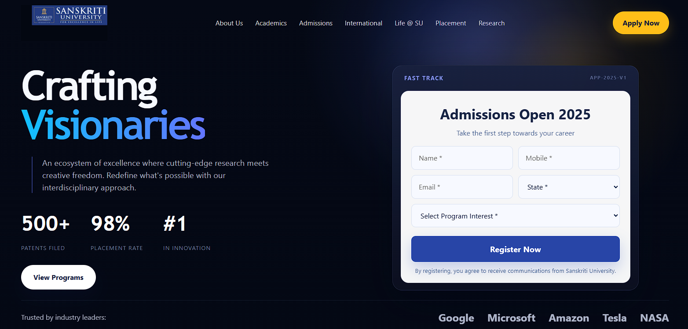

# 🎓 Sanskriti University UI (Full Stack Project)

A modern, responsive university landing page built using React and Node.js.  
This project showcases a professional admission interface with a fast-track registration form and clean UI design.

---

## 🚀 Features

- 🎯 Modern landing page UI (Hero section + navigation)
- 📝 Admission form with input fields (Name, Mobile, Email, State, Program)
- ⚡ Responsive design for better UX

---

## 🖼️ Preview

---

## 🛠 Tech Stack

### Frontend
- React.js
- JavaScript (ES6+)

### Backend
- Node.js
- Native HTTP Module

---
